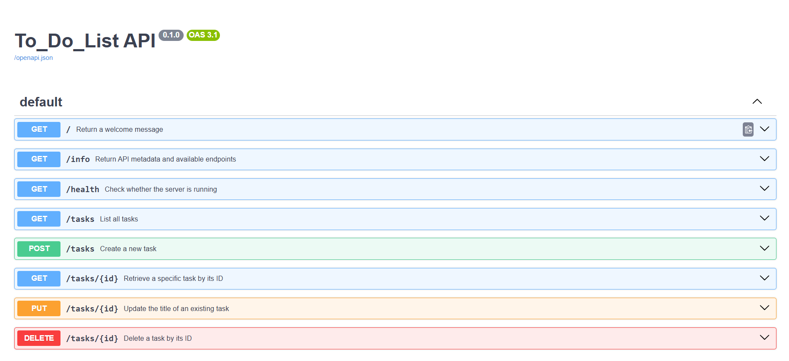

date: Fri, 07 Aug 2026 03:45:00 GMT
# Task Manager API 🚀

A small RESTful Task Manager API built with FastAPI and Python. Use it to create, read, update, and delete simple todo items while exploring FastAPI features, SQLite database integration, and the auto-generated documentation.

---

## Features

- **SQLite Database Storage** - Persistent task storage with automatic database initialization.
- CRUD endpoints for managing tasks: list, retrieve, create, update, delete.
- Interactive API docs (Swagger UI and ReDoc) when the server is running.
- Automatic database schema creation on first run.

## Database Information

### Why SQLite?

SQLite was chosen for this project because:
- **Lightweight and File-Based**: No server setup required; database is stored as a single file
- **Perfect for Development**: Ideal for learning and prototyping without complex database configuration
- **Zero Configuration**: Works out of the box with automatic schema creation
- **Reliable**: Provides ACID compliance for data integrity
- **Easy to Share**: Database file can be easily version controlled or shared

### Database File Location

The SQLite database file is stored at:
```
./tasks.db
```
This file is created automatically in the project root directory when the server starts for the first time. The database schema is initialized automatically via the lifespan event handler.

### Example SQL Query

To retrieve all completed tasks from the database:
```sql
SELECT id, title, done FROM tasks WHERE done = 1 ORDER BY id;
```

This query returns all tasks with `done = true` in the order they were created.

## Prerequisites

- Python 3.8+
- pip

## Install & Run

Install the runtime dependencies and start the development server:

```bash
pip install fastapi uvicorn sqlmodel
python main.py
```

Alternatively, using uvicorn directly:
```bash
uvicorn main:app --reload
```

The server will run at http://127.0.0.1:8000 by default.

**Note:** The database file (`tasks.db`) will be automatically created in the project root directory on the first run with sample data.

## Endpoints (summary)

- `GET /` — Return a welcome message.
- `GET /health` — Check whether the server is running.
- `GET /tasks` — List all tasks.
- `GET /tasks/{id}` — Retrieve a specific task by its ID.
- `POST /tasks` — Create a new task (JSON body: `{"title": "Your title"}`).
- `PUT /tasks/{id}` — Update the title of an existing task (JSON body: `{"title": "New title"}`).
- `DELETE /tasks/{id}` — Delete a task by its ID.

## Examples

- List tasks

```bash
curl http://127.0.0.1:8000/tasks
```

- Get a single task

```bash
curl http://127.0.0.1:8000/tasks/1
```

- Create a task

```bash
curl -i -X POST "http://127.0.0.1:8000/tasks" -H "Content-Type: application/json" -d '{"title": "Learn FastAPI"}'
```

- Update a task's title

```bash
curl -i -X PUT "http://127.0.0.1:8000/tasks/1" -H "Content-Type: application/json" -d '{"title": "Updated Task Title"}'
```

- Delete a task

```bash
curl -i -X DELETE "http://127.0.0.1:8000/tasks/1"
```

> Note: All data is persisted to the SQLite database (`tasks.db`) and will be available after restarting the server.

## Database Viewer

A visual HTML database viewer has been included in the project. You can open it to inspect the SQLite database contents:

**File:** `db_viewer.html`

Open this file in your browser to see all tasks currently stored in the database with their IDs, titles, and completion status.

The database viewer shows:
- Database file location: `./tasks.db`
- Table name: `tasks`
- All records with their current state
- Color-coded completion status (green for completed, orange for pending)

Below is a screenshot of the database viewer displaying the current tasks:

```
┌─────────────────────────────────────────────────────────────┐
│         📊 SQLite Database Viewer - Task Manager            │
├─────────────────────────────────────────────────────────────┤
│ Database File: ./tasks.db                                   │
│ Table Name: tasks                                           │
│ Total Records: 6                                            │
├─────┬───────────────────────┬─────────────────────────────┤
│ ID  │ Title                 │ Completed                   │
├─────┼───────────────────────┼─────────────────────────────┤
│ 0   │ testing put           │ ✓ True  (green)            │
│ 1   │ study linear algebra  │ ✗ False (orange)           │
│ 2   │ stage 0               │ ✓ True  (green)            │
│ 3   │ buy milk              │ ✗ False (orange)           │
│ 4   │ string                │ ✓ True  (green)            │
│ 5   │ string                │ ✓ True  (green)            │
└─────┴───────────────────────┴─────────────────────────────┘
```

## Interactive Documentation

FastAPI provides interactive docs at:

- Swagger UI: http://127.0.0.1:8000/docs
- ReDoc: http://127.0.0.1:8000/redoc

## Contributing

Contributions are welcome. If you fix bugs or improve the API, open a PR or send a patch and describe the change.

## API Screenshot

The following screenshot shows the API documentation UI (Swagger) while the server is running:

